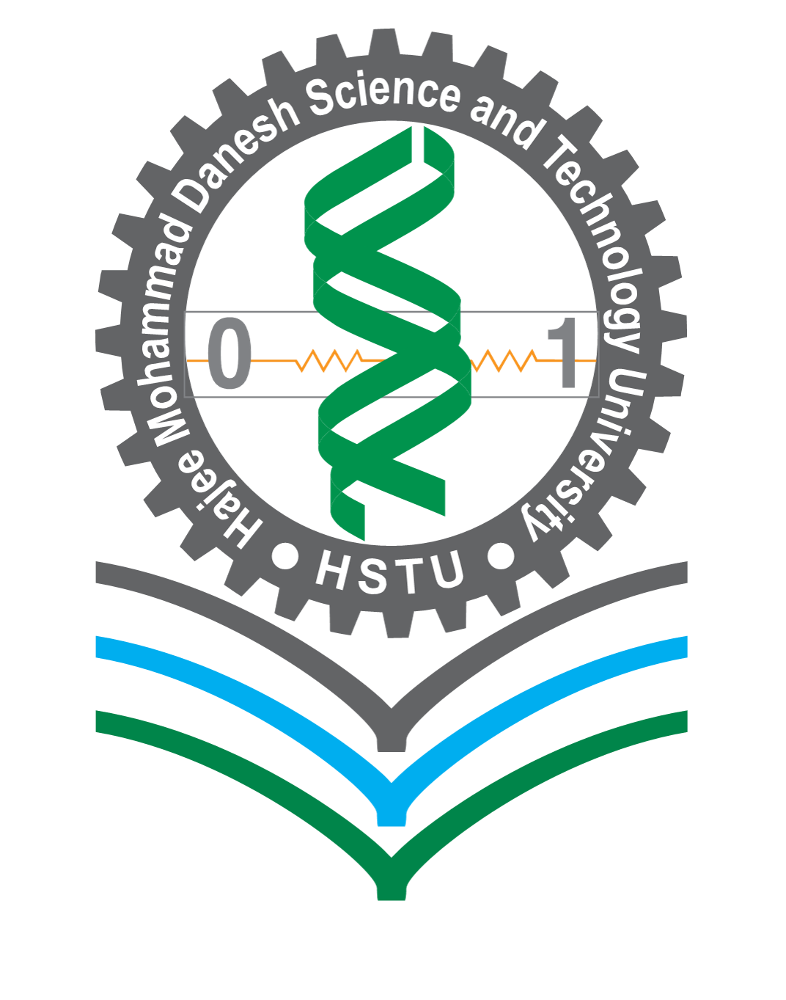

<h1 align="center">
  <b>"Student Performance Tracker in Competitive Programming"</b>
</h1>

---

This project shows student progress by tracking their accounts across various competitive programming platforms and contests. 
 
By utilizing the Agile methodology, it ensures flexibility and continuous improvement to meet the evolving needs of the learners.

---

<h2 align="center" ">
  <em>Course Information</em>
</h2>

  Course Title: Software Engineering  
   
  Course Code: CSE 305  

<h2 align="center" >
  <em>Submitted To</em>
</h2>

  Name: Pankaj Bhowmik  
   
  Designation: Lecturer  
   
  Department: Computer Science and Engineering  

<h2 align="center">
  <em>Submitted By</em>
</h2>

  Name: Sourav  
   
  Student ID: 2102008  
   
  Level: 3  
   
  Semester: I  
   
  Department: Computer Science and Engineering  

  

<h2 align="center" ">
  <b>Hajee Mohammad Danesh Science and Technology University,</b>
<b>Dinajpur-5200</b>
